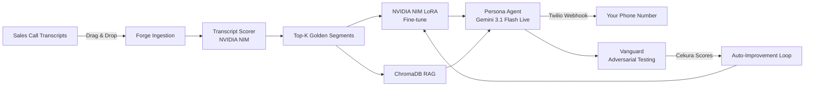

# Forge

> Upload your sales call transcripts. Get a production-ready voice agent. Paste one webhook. Done.

Built for the **Voice Agents Hackathon** — Cekura · Daily · NVIDIA · AWS · Pipecat · Twilio

---

## How It Works



---

## Key Numbers

| Metric | Value |
|--------|-------|
| Transcripts processed | 50–100 per build |
| Scoring dimensions | 5 (empathy, objection handling, naturalness, flow, closing) |
| Vanguard attack personas | 8 |
| Default attack sessions | 12 per run |
| Expected baseline pass rate | ~47–55% |
| After 2 improvement cycles | ~80%+ |

---

## Sponsors

| Sponsor | Role in Forge |
|---------|--------------|
| **NVIDIA** | LoRA fine-tuning + RAG embeddings (NIM APIs) |
| **Daily** | WebRTC transport for all voice sessions |
| **Pipecat** | Voice pipeline framework |
| **Twilio** | Telephony — inbound call handling |
| **Cekura** | Automated transcript evaluation |
| **AWS** | Compute (EC2) + storage (S3) |

---

## Quick Start

```bash
cd forge
cp .env.example .env       # fill all required keys
pip install -r requirements.txt
uvicorn api.main:app --host 0.0.0.0 --port 8000 --reload

# Frontend (separate terminal)
cd frontend && npm install && npm run dev
```

See [DEPLOYMENT.md](DEPLOYMENT.md) for full setup including Twilio webhook config and AWS.

---

## API Endpoints

| Method | Path | What it does |
|--------|------|-------------|
| POST | `/users/{id}/ingest` | Upload a file → ingestion pipeline |
| POST | `/users/{id}/build` | Trigger full build: score → personality → RAG → fine-tune |
| GET | `/users/{id}/build/status` | Poll build progress |
| GET | `/users/{id}/status` | System readiness (personality, voice, RAG, etc.) |
| POST | `/users/{id}/call` | Create Daily room + start persona bot |
| POST | `/join_room` | Join existing Daily room as persona bot |
| POST | `/webhook/twilio/inbound` | Twilio inbound call → TwiML |
| WS | `/media-stream` | Twilio WebSocket → Gemini Live pipeline |
| POST | `/users/{id}/vanguard/run` | Launch adversarial attack suite |
| GET | `/users/{id}/vanguard/runs` | List all run summaries |
| GET | `/users/{id}/vanguard/runs/{run_id}` | Full run result + transcripts |
| GET | `/users/{id}/vanguard/runs/{run_id}/live` | Live session stream (polling) |
| POST | `/users/{id}/vanguard/improve` | Trigger improvement cycle |
| GET | `/users/{id}/dashboard` | Aggregated view: personality, pass rates, cycles |
| POST | `/chat` | Direct text chat with the persona (latency test) |

**user_id convention:** `"demo"` is hardcoded in the frontend. Use `"demo"` for all curl tests.

---

## Scripts

```bash
# Verify backend health
curl http://localhost:8000/users/demo/status

# Upload a file
curl -X POST http://localhost:8000/users/demo/ingest \
  -F "file=@/path/to/sales_call.wav"

# Trigger build
curl -X POST http://localhost:8000/users/demo/build

# Poll build status
watch -n 3 'curl -s http://localhost:8000/users/demo/build/status | python -m json.tool'

# Launch Vanguard attack
curl -X POST http://localhost:8000/users/demo/vanguard/run

# Poll Vanguard live results
curl http://localhost:8000/users/demo/vanguard/runs/<run_id>/live

# Trigger improvement cycle
curl -X POST http://localhost:8000/users/demo/vanguard/improve

# Full dashboard
curl http://localhost:8000/users/demo/dashboard | python -m json.tool

# Test NVIDIA NIM directly
curl -s https://integrate.api.nvidia.com/v1/chat/completions \
  -H "Authorization: Bearer $NVIDIA_API_KEY" \
  -H "Content-Type: application/json" \
  -d '{"model":"meta/llama-4-maverick-17b-128e-instruct","messages":[{"role":"user","content":"Say OK"}]}' \
  | python -m json.tool
```

---

## Project Docs

| Doc | Purpose |
|-----|---------|
| [CLAUDE.md](CLAUDE.md) | Full project reference for Claude agents |
| [AGENTS.md](AGENTS.md) | Codex-compatible mirror + skill catalog |
| [HANDOFF.md](HANDOFF.md) | Subsystem data contracts and interface specs |
| [DEPLOYMENT.md](DEPLOYMENT.md) | Setup, AWS, Twilio, demo runbook |
| [wiki/](wiki/) | Long-form guides and research notes |
| [decisions/](decisions/) | Architecture decision records |

---

## Stack

Pipecat · Gemini 3.1 Flash Live · NVIDIA NIM · Twilio · Daily · Cekura · ChromaDB · FastAPI · Next.js · AWS
